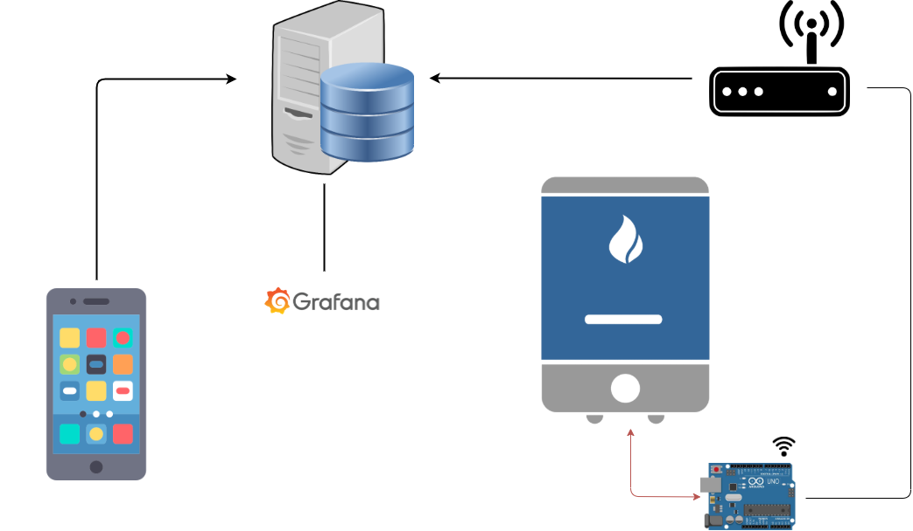
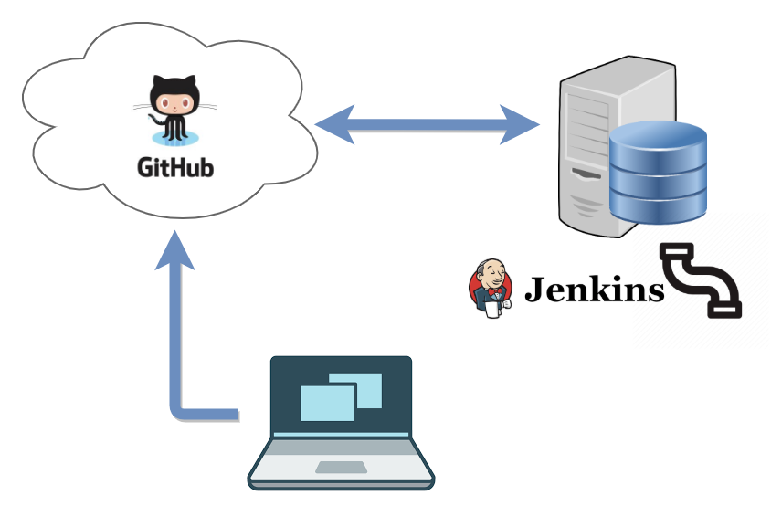
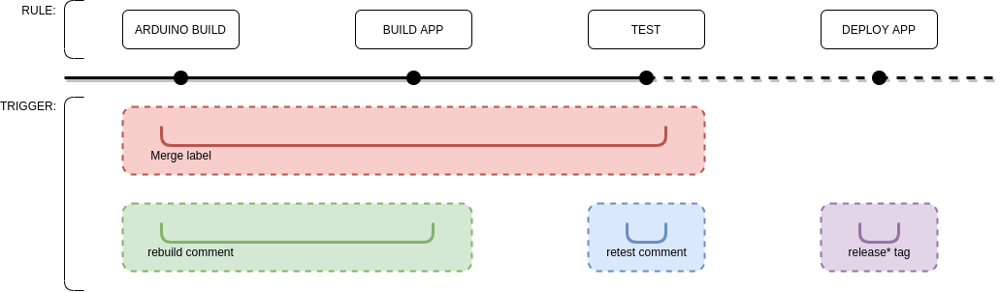

# Remote Control for Heating System

## General description

The system aims to be a simple way to turn on and off the Fragno Heating System (FHS) and access useful data like actual temperature and history of temperature inside and outside the house. The system will be accessible to all users trought a custom android application. 

## Project Management
Project is managed via GitHub SCM and Jenkins in order to guarantee the code to be always build and tested. Jenkins runs on a local server with which GitHub communicates in order to trigger jobs for building testing and deploying. Jenkins service potentially allows to keep track of each commit build and test history. Here briefly explained the way the workflow is designed.

 

### CI / CD Jenkins Pipeline

Jenkins allows the definition of jobs triggerable directly from GitHub, The following pipeline has been choosen for this project allowing the developer a user friendly and accessible way to mantain the code, trigger tests and deploy the application

&nbsp;

  
 

## Needed prerequisites

The app should be installed on your phone

## Installation
## How to use / use cases
## known bugs
## FAQ
## Table of content
## License

I don't take any responsability in case of Arduino or other parth malfunctioning

